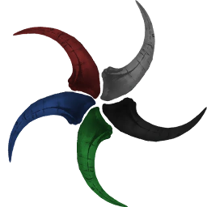

  

# tiamat - Tiled Image Access, Manipulation, and Analysis Toolkit

__Author:__ Christian Schiffer (c.schiffer@fz-juelich.de), Institute for Neuroscience and Medicine (INM-1), Forschungszentrum Jülich

__Acknowledgement:__
This project has received funding from the Helmholtz Association’s Initiative and Networking Fund through the Helmholtz International BigBrain Analytics and Learning Laboratory (HIBALL) under the Helmholtz International Lab grant agreement InterLabs-0015.

*The future of image service is now.*

## Concepts

`tiamat` uses a pipeline to model the flow of reading images and transformations.
A pipeline consists of `readers` for reading images and their metadata, and `transformers`, which apply transformations to images or the access (e.g., coordinates).
`readers` are implemented in `timat.readers`, according to a protocl defined in `timat.readers.protocol`.
`transformers` are implemented in `tiamat.transformers`, according to a protocol defined in `tiamat.transformers.protocl`.

## Examples

- Examples on how to use `tiamat` are given in [examples](./examples).
- A microdraw configuration using `tiamat` can be found [here](http://ime262.ime.kfa-juelich.de:3000/data?source=http://ime262.ime.kfa-juelich.de/microdraw/data/tiamat/B20.json) and [here](http://ime262.ime.kfa-juelich.de:3000/data?source=http://ime262.ime.kfa-juelich.de/microdraw/data/tiamat/B20_rainbow.json).

## Services using `tiamat`

- [tiamat-md](https://jugit.fz-juelich.de/inm-1/bda/tiamat/tiamat-md.git): Microdraw/OpenSeaDragon compatible image service.

## State of development

`tiamat` is currently in the state of a minimal viable product.
It can certain image formats, apply some transformations, and can be used in 

### Implemented

- Readers for generic images (e.g., png, jpeg) and BigTiff.
- Some transformers to demonstrate principles (e.g., `FractionalTransformer`, `AffineTransformer`, `LUTTransformer`).
- [tiamat-md](https://jugit.fz-juelich.de/inm-1/bda/tiamat/tiamat-md.git) as Microdraw tile server.

### TODO

- Testing of functionality.
- Implement more image formats (e.g., HDF5, NIFTI, Zarr, ng-precomputed).
- Align implementation with requirements for 3D image formats. 
- Implement more complex transformers (e.g., deformation fields, deep learning).
- Perhabs refactoring of certain functions. 
- Critical review of low-level image access logic (e.g., padding, clipping).
- Implementation of a 3D image service (e.g., `tiamat-ng`).
- Documentation and coding style enforcement.

## Coding Style

- Use type hinting
- Use google docstring style
- flake8 formatting (120)
- unit tests (pytest)
- main branch is locked, modifications through MRs from feature branches

## Data

Data included in this repository (e.g., example or test data) requires `git-lfs`.
