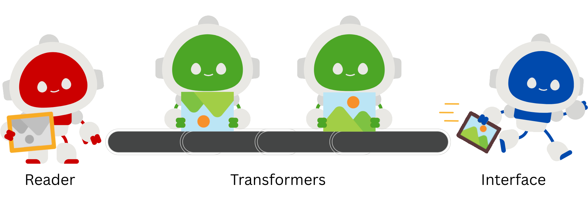

.. _core-concepts:
.. title:: Core Concepts - tiamat

=============
Core Concepts
=============

    The RTI Model: Readers bring in raw data, transformers process it, and interfaces deliver it to clients.
    Pipelines connect these components into a coherent workflow.

----------------------------------
Reader–Transformer–Interface Model
----------------------------------

At the heart of tiamat is the Reader–Transformer–Interface Model (RTI Model). Picture an assembly line:
**Readers** bring in the raw materials, **transformers** are the processing stations that refine or alter those 
materials, and **interfaces** are the shipping and distribution units that deliver the finished product to the outside 
world.

* **Reader — the raw-material supplier**
    A reader is responsible for acquiring precisely the data that is needed from storage. It reads precisely the chunk 
    you requested, and hands raw pixel arrays and metadata to the next stage. Readers understand storage formats, 
    tiling layouts, metadata conventions, and chunking schemes, like TIFF tiling patterns, OME-Zarr chunk layouts, 
    NIfTI axes and scaling, etc. When a request arrives, the reader fetches the relevant region of the dataset
    and hands both the image data and metadata to the next processing station. Because tiamat supports multiple readers, 
    you can point the same pipeline at differently formatted datasets and the readers do the format detective work for 
    you. 
* **Transformer(s) — the processing stations**
    Transformers are small modules that modify or refine the data on the fly.
    They can change coordinates (e.g., map physical z positions to slice indices), mutate metadata (update channel 
    counts or spatial units), re-order axes, apply color maps, normalize intensities, or even run a small AI model to 
    produce a segmentation mask for that tile. Importantly, transformers operate only on the requested tile/region — 
    so heavy compute is localized to what the user actually needs. Each transformer takes the output of the previous
    stage, processes it, and forwards the result along the pipeline. Multiple transformers 
    can be chained, allowing highly customizable processing flows.
* **Interface — the distribution unit**
    Finally, the transformed result is presented to clients. 
    Interfaces adapt to the client’s needs: a RESTful API for Neuroglancer, a tile server for OpenSeadragon, an 
    in-process NumPy array for Python scripts, or a FUSE filesystem exposing a virtual Zarr hierarchy. This design 
    decouples the "how" of storage from the "how" of consumption so one pipeline can feed many front ends. The 
    available interface modules in the project include tiamat-ng (Neuroglancer), tiamat-openseadragon, tiamat-napari, 
    tiamat-fuse-zarr, and tiamat-array.

This structured separation ensures that each part of the system can evolve independently. Adding support for a new file 
format only requires a new reader; adding a new tool only requires a new interface; and new analytical or visual steps 
can be introduced by adding or reorganizing transformers.

---------
Pipelines
---------

While readers, transformers, and interfaces are the individual stations of the factory, 
the **pipeline** is the complete production line that connects them into a
coherent process. It defines how raw materials flow through the factory, how many
processing steps are applied, and how the final product is delivered.

A pipeline:

- combines a chosen reader, an ordered set of transformers, and the target interface,
- ensures that data flows through the stages in a predictable and reproducible manner,
- handles the orchestration of metadata updates, access transformations, and result
  delivery,
- allows the same dataset to be processed in different ways simply by selecting or
  reordering transformers,
- and can be reused across many datasets and interfaces without modification.

Because pipelines are fully declarative in structure and deterministic in behavior, they
serve as a precise definition of how any given piece of data is interpreted and processed.
This makes them ideal not only for interactive exploration but also for reproducible
workflows, versioned data products, and automated analysis setups. In practice, pipelines
are the mechanism that turns tiamat from a collection of components into a flexible
framework for data access, manipulation, and visualization.

-----------------------
Lazy evaluation
-----------------------

Tiamat performs all operations lazily: nothing is loaded or transformed until a client
actually requests it. This keeps memory usage minimal and avoids unnecessary computation,
which is particularly valuable for large datasets where users typically access only small
regions at a time.

Because transformations may alter not only pixel values but also structural aspects
(channel count, axis order, spatial relationships), metadata is treated as a fully
validated product flowing through the pipeline. Transformers therefore explicitly update
metadata using a dedicated method, ensuring that every change in the data is matched with
a consistent update in its descriptive information.
